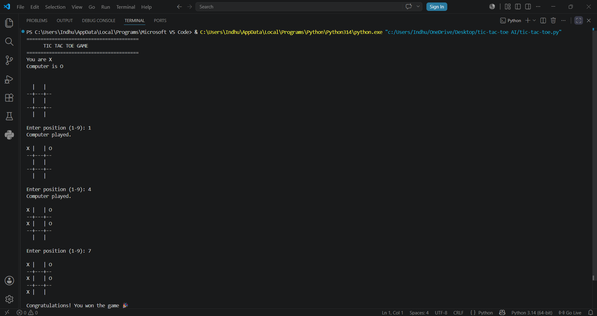

# CodSoft AI Internship

This repository contains the AI projects completed as part of the CodSoft AI Internship using Python.

## Projects

### 1. Chatbot
A simple rule-based chatbot that interacts with users and responds to predefined queries.

**Technologies Used:**
- Python

### 2. Tic-Tac-Toe AI
An interactive Tic-Tac-Toe game where users can play against the computer.

**Technologies Used:**
- Python

### 3. Recommendation System
A recommendation system that suggests items based on user preferences and similarity measures.

**Technologies Used:**
- Python

## Output Screenshots

### Chatbot Output

### Chatbot Continuous Conversation

### Recommendation System Output

### Tic-Tac-Toe Output

## Author
Indhu Goud
